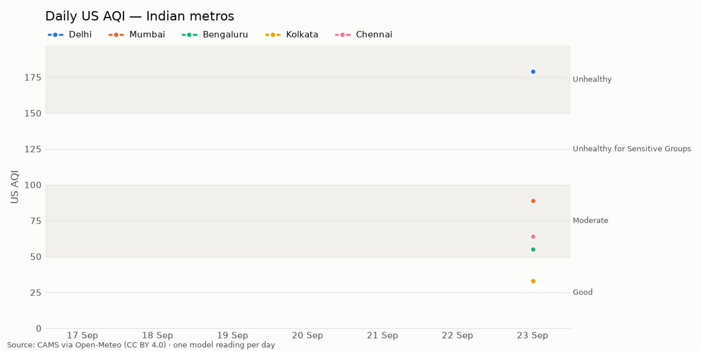

# india-aqi-tracker

[](https://github.com/Georgian-86/india-aqi-tracker/actions/workflows/daily.yml)
[](https://github.com/Georgian-86/india-aqi-tracker/actions/workflows/ci.yml)

A [git scraping](https://simonwillison.net/2020/Oct/9/git-scraping/) project that records the
air quality of five Indian metros — **Delhi, Mumbai, Bengaluru, Kolkata and Chennai** — once a
day and commits the result to this repository. The git history *is* the database.

## Today's air quality

<!-- AQI:START -->
**Latest snapshot: 2026-09-23** (fetched 22:00 IST · 1 day collected)

| City | US AQI | Category | PM2.5 (µg/m³) | PM10 (µg/m³) | NO₂ (µg/m³) | O₃ (µg/m³) |
|---|--:|---|--:|--:|--:|--:|
| Delhi | 179 | 🔴 Unhealthy | 99.7 | 111.3 | 60.2 | 73 |
| Mumbai | 89 | 🟡 Moderate | 34.7 | 46.7 | 16 | 78 |
| Bengaluru | 55 | 🟡 Moderate | 16.6 | 22.8 | 14.5 | 64 |
| Kolkata | 33 | 🟢 Good | 8.4 | 9.2 | 9.2 | 45 |
| Chennai | 64 | 🟡 Moderate | 14.5 | 16 | 24.7 | 50 |


<!-- AQI:END -->

AQI categories follow the US EPA scale:
🟢 Good (0–50) · 🟡 Moderate (51–100) · 🟠 Unhealthy for Sensitive Groups (101–150) ·
🔴 Unhealthy (151–200) · 🟣 Very Unhealthy (201–300) · 🟤 Hazardous (301+).

## How it works

Every day at **03:17 UTC (08:47 IST)** the GitHub Actions workflow
[`.github/workflows/daily.yml`](.github/workflows/daily.yml):

1. runs the test suite (`pytest`, no network);
2. runs **`fetch.py`**, which makes a *single* request to the
   [Open-Meteo Air Quality API](https://open-meteo.com/en/docs/air-quality-api) with all five
   cities' coordinates, asks for the current `us_aqi`, `pm2_5`, `pm10`, `nitrogen_dioxide` and
   `ozone`, and appends one row per city to [`data/aqi.csv`](data/aqi.csv).
   Rows are keyed by `(date, city)` using the IST date, so re-running on the same day never
   duplicates data. Network errors, timeouts, HTTP 429 and 5xx are retried with exponential
   backoff. The run fails (goes red) instead of recording something wrong if the retries run
   out, the data is more than 6 hours old, the locations come back in an unexpected order, or
   a city has no AQI value. In the last case the other cities are still saved;
3. runs **`make_chart.py`** to redraw [`charts/aqi_trend.png`](charts/aqi_trend.png);
4. runs **`update_readme.py`** to rewrite the section between the `AQI:START` / `AQI:END`
   markers above;
5. commits `data: AQI snapshot YYYY-MM-DD` and pushes to `main`, but only if something
   actually changed.

A **backup run at 06:17 UTC (11:47 IST)** does the same thing. It adds nothing if the morning
run succeeded, and fills in any city the morning run missed (for example, if GitHub skipped
the scheduled run, which it sometimes does under load).

You can also trigger a run by hand from the **Actions** tab (`workflow_dispatch`). Note that
the first run of an IST day is the one that counts: a manual run at 22:00 records a 22:00
reading for that date, and the next morning's run won't replace it. The README shows the
actual fetch time.

A separate [CI workflow](.github/workflows/ci.yml) runs `ruff` and `pytest` on every pull
request and push to `main`. Dependencies are pinned exactly in `requirements.txt`, and
Dependabot proposes upgrades monthly.

### Data format

`data/aqi.csv`:

| column | meaning |
|---|---|
| `date` | local date in Asia/Kolkata (from the API's `current.time`) |
| `city` | Delhi, Mumbai, Bengaluru, Kolkata or Chennai |
| `us_aqi` | US AQI (0–500) |
| `pm2_5`, `pm10` | particulate matter, µg/m³ |
| `no2` | nitrogen dioxide, µg/m³ |
| `o3` | ozone, µg/m³ |
| `fetched_at_utc` | when the snapshot was taken, ISO-8601 UTC |

### Caveats

- Values are **model estimates** from the CAMS global forecast (~40 km grid), not readings
  from ground monitoring stations. They are good for trends and comparisons but can differ
  from official CPCB station readings.
- Each row is **one instantaneous reading**, not a daily average. Pollution follows a daily
  cycle (in winter it's usually worst in the early morning), so readings are only comparable
  across days when they were taken at a similar time. Check `fetched_at_utc`.

## Running locally

Requires Python 3.12.

```bash
python -m venv .venv && source .venv/bin/activate
pip install -r requirements.txt

pytest                      # offline tests (API is mocked)
ruff check .                # lint (pip install ruff)
python fetch.py             # real API call → data/aqi.csv
python make_chart.py        # → charts/aqi_trend.png
python update_readme.py     # → README.md section
```

## Attribution

Air quality data is provided by **[Open-Meteo](https://open-meteo.com/)** under the
[Creative Commons Attribution 4.0 (CC BY 4.0)](https://creativecommons.org/licenses/by/4.0/)
licence. See the [Open-Meteo licence page](https://open-meteo.com/en/license).

Open-Meteo's air quality data is derived from the
**[Copernicus Atmosphere Monitoring Service (CAMS)](https://atmosphere.copernicus.eu/)**:

> Generated using Copernicus Atmosphere Monitoring Service information 2026.
> Neither the European Commission nor ECMWF is responsible for any use that may be made of
> the Copernicus information or data it contains.

The CSV data in this repository is a derived work and is shared under the same CC BY 4.0
terms. Please keep these attributions if you reuse it.
